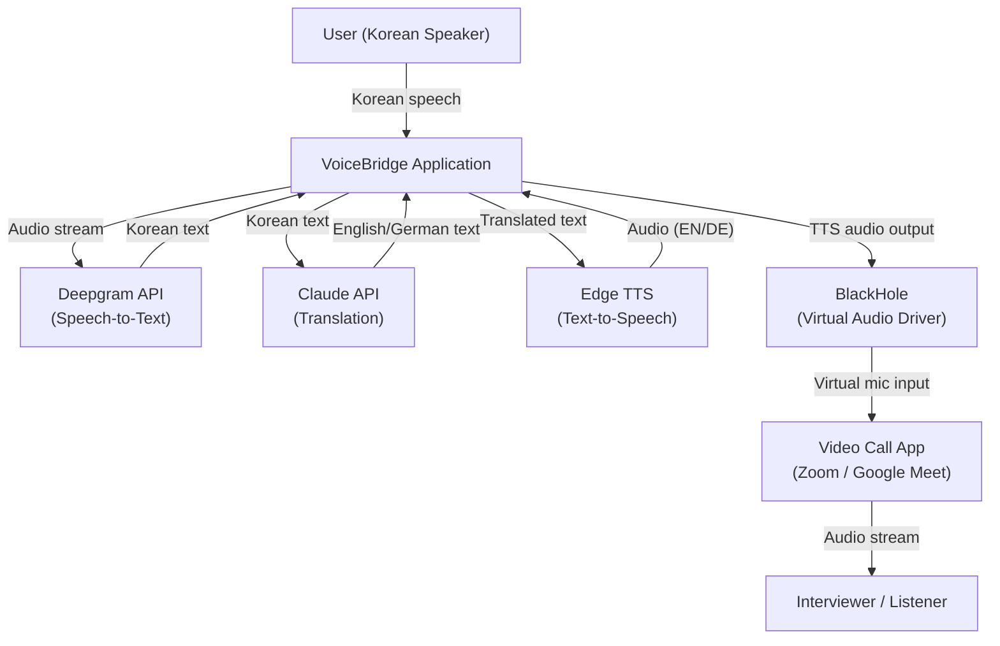
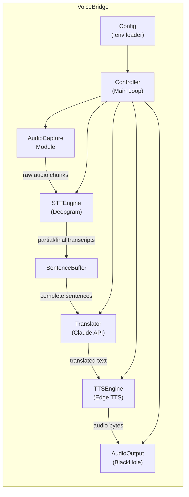
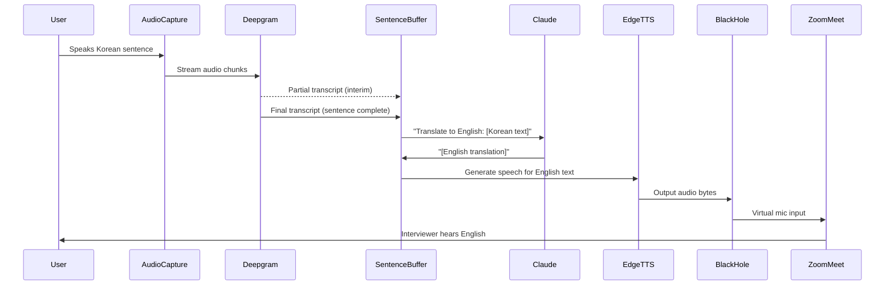
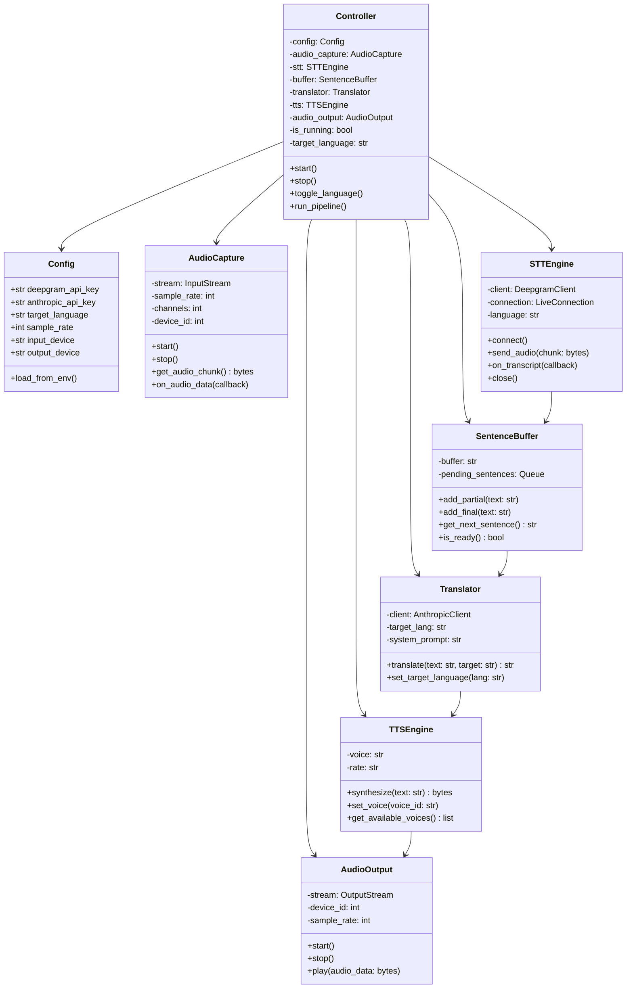
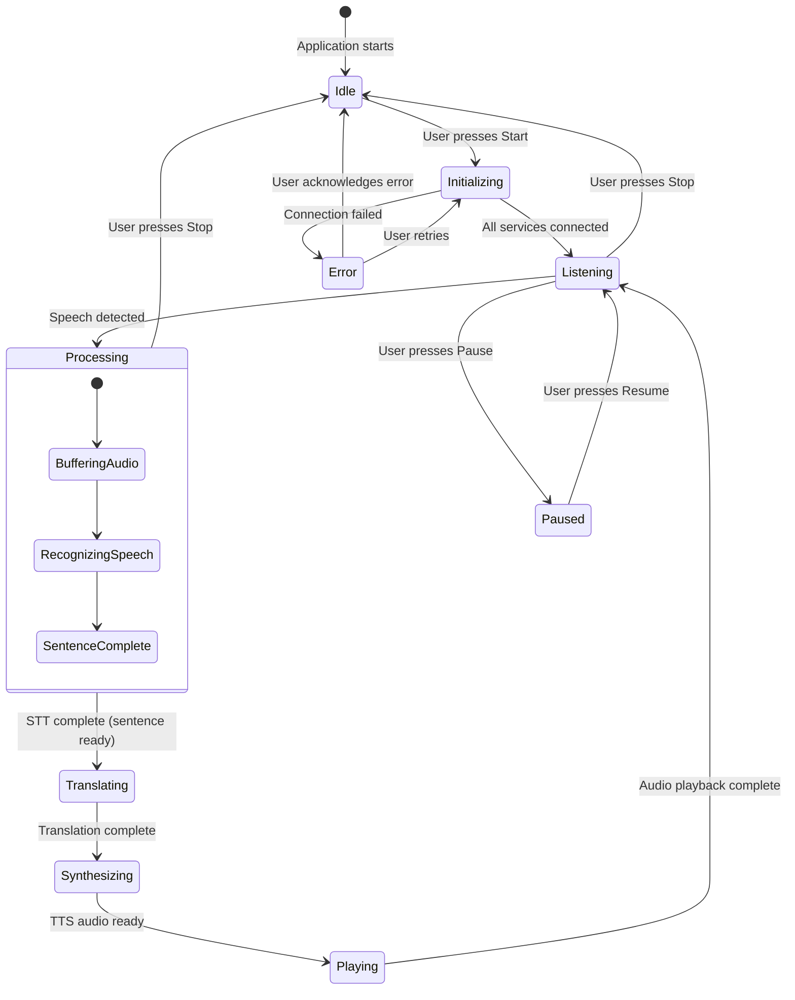
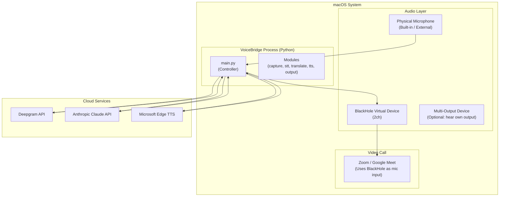

# UML Diagrams
# VoiceBridge - Real-Time Voice Translation Tool

All diagrams below are in Mermaid syntax and can be rendered in any Mermaid-compatible viewer (GitHub, VS Code with Mermaid extension, mermaid.live).

---

## 1. System Context Diagram

Shows VoiceBridge in relation to external systems and actors.

---

## 2. Component Diagram

Shows internal modules of VoiceBridge and their relationships.

---

## 3. Sequence Diagram

Shows the end-to-end flow for a single spoken sentence.

---

## 4. Class Diagram

Shows the main classes/modules and their responsibilities.

---

## 5. State Diagram

Shows the application states during operation.

---

## 6. Deployment Diagram

Shows how VoiceBridge runs on the user's macOS system.

---

## Notes on Architecture Decisions

1. **Linear pipeline**: The design is intentionally a simple linear pipeline rather than a complex event-driven architecture. This keeps the code simple and debuggable within the 6-day timeline.

2. **SentenceBuffer as coordinator**: The buffer sits between STT and translation to accumulate partial transcripts into complete sentences before sending them for translation. This prevents fragmented or incoherent translations.

3. **Controller as orchestrator**: A single Controller class manages the entire pipeline lifecycle. This aligns with the "orchestrator-level" developer skill being demonstrated.

4. **No persistent state**: The application is stateless between sessions. No database, no file storage. This keeps things simple.
